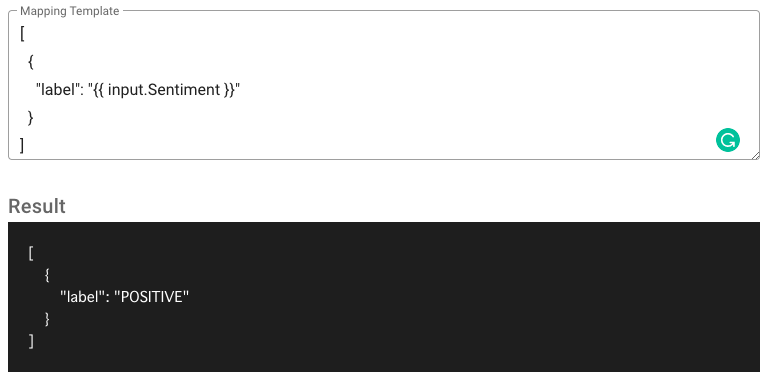
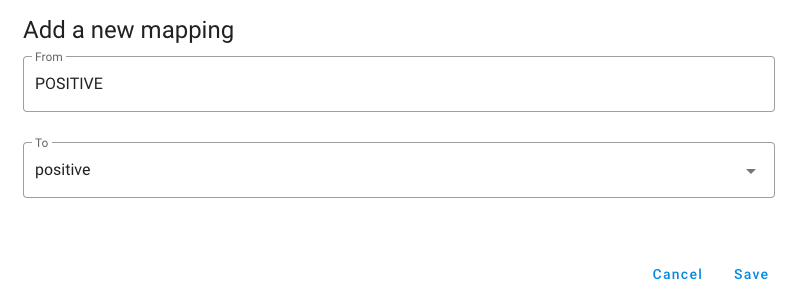
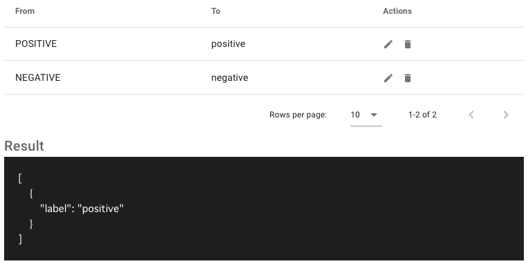
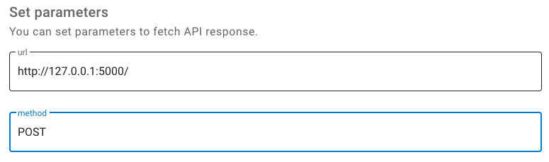

# Setup Auto Labeling

In this tutorial, you will learn how to set up and use the auto-labeling feature. Auto-labeling is a feature that automates labeling using the Web API. This is not required to use doccano, but if you set it up, you will be able to label data more efficiently.

The tutorial is divided into several sections:

- Select a Template will give you a starting point to follow the tutorial.
- Set Request Parameters will teach you how to set parameters required to send a request.
- Specify Response Mapping will teach you the way to extract the label information from the response.
- Specify Label Mapping will give you the way to map the extracted labels to the internal labels of doccano.
- Enable the Feature will show you how to enable the auto-labeling.

In this tutorial, we will show you how to set up auto-labeling using Amazon Comprehend Sentiment Analysis as an example. Therefore, we assume that you have a text classification project in doccano, an AWS account and be able to generate access keys.

## Use pre-defined service

### Select a Template

First, move to the "settings" page and open "Auto Labeling" tab. The new tab should display a "Create" button and an empty table. Click the button and select "Amazon Comprehend Sentiment Analysis" from the dropdown menu:


### Set Request Parameters

Next, you need to set parameters to send an API request. In the case of Amazon Comprehend Sentiment Analysis, the following parameters are required:

- aws_access_key
- aws_secret_access_key
- region_name
- language_code

In the following example, we set `us-west-2` as a `region_name` and `en` as a `language_code`:


Then, we will test them using the sample text to make sure whether the parameters are set correctly or not. In this case, we set "I like you" as a sample text and be able to get the response from Amazon Comprehend Sentiment Analysis. If you look at the Sentiment field in the response, you will see that its value is POSITIVE:


### Specify Response Mapping

Now, you can successfully fetch the API response. Next, you need to convert it to doccano format(below) with the mapping template([Jinja2](https://jinja.palletsprojects.com/en/2.11.x/) format).

```plain
Text Classification
[{ "label": "Cat" }, ...]

Sequence Labeling
[{ "label": "Cat", "start_offset": 0, "end_offset": 5 }, ...]

Sequence to sequence
[{ "text": "Cat" }, ...]
```

In the case of Amazon Comprehend Sentiment Analysis, we want to get `Sentiment` value from the response. As we can access the entire response by the `input` variable, the mapping template looks like the following:

```json
[
  {
    "label": "{{ input.Sentiment }}"
  }
]
```

After setting the template, we will test them using the sample response. This response is the same one we fetched in the `Set Request Parameters` section.



### Specify Label Mapping

Once you specify the mapping template, you need to convert the label in the response into the one you defined at the label page.

Click the `Add` button and fill in the `From` and `To` fields. `From` means the response label string. In this case, we can specify `POSITIVE`. `To` means the label of this project. In this case, we specify `positive`:



After adding the label mapping, we will test them using the sample response:



### Enable the Feature

Finally, move to the "annotation" page and click "Auto Labeling" button. It should display a "Slide" button for switching enable/disable auto-labeling feature. Try to enable it:


Each time you view a new document, it will be labeled automatically.

## Use your own API

First, select "Custom REST Request":


Next, you need to build your own API. Any framework can be used. Here we will use [Flask](https://flask.palletsprojects.com/en/2.2.x/) to create a minimal application. This application always returns the same label（`{"label": "NEG"}`）. We also call `get_json` method and output its return value to make sure we can receive the data.

```bash
from flask import Flask, request

app = Flask(__name__)

@app.route("/", methods=["POST"])
def predict():
    print(request.get_json())
    return {"label": "NEG"}
```

Save it as `hello.py` or something similar. Make sure to not call your application `flask.py` because this would conflict with Flask itself.

To run the application, use the `flask` command. You need to tell the Flask where your application is with the `--app` option.

```bash
$ flask --app hello run
 * Serving Flask app 'hello'
 * Debug mode: off
 * Running on http://127.0.0.1:5000
Press CTRL+C to quit
```

OK. Let's return to doccano.

Next, you need to set parameters(`url` and `method`). Let's set the Flask application's URL and method:



Next, select the add button next to Body. Enter `text` as key and `{{ text }}` as value. This value is a placeholder and will actually be replaced by your own text.


Then, test the parameters with the sample text. If it is working correctly, it should return `{"label": "NEG"}`.


You should also see the following in the console:

```bash
127.0.0.1 - - [13/Sep/2022 15:19:57] "GET / HTTP/1.1" 405 -
{'text': 'This is a test sentence.'}
```

Next, convert the response from your API into a format that doccano can handle. We can access the response by the `input` variable. The mapping template looks like the following:

```bash
[
  {
    "label": "{{ input.label }}"
  }
]
```

Test the mapping template. If it is working correctly, it should be as follows:

```bash
[
    {
        "label": "NEG"
    }
]
```

The rest is the same as when using a predefined service.
