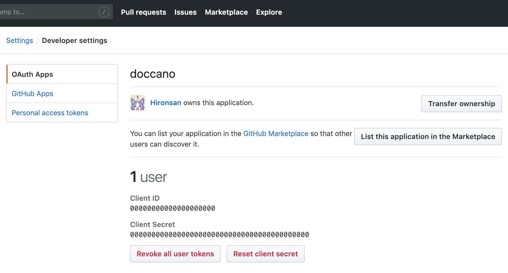
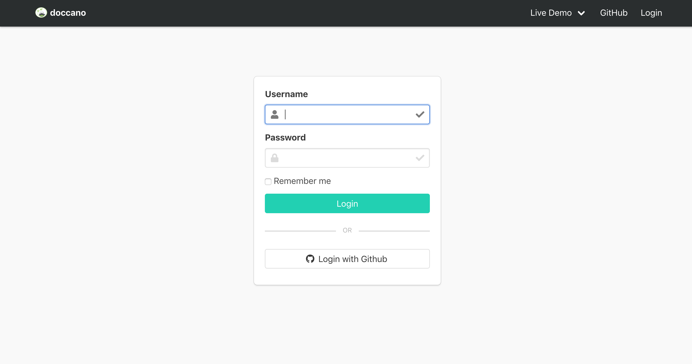
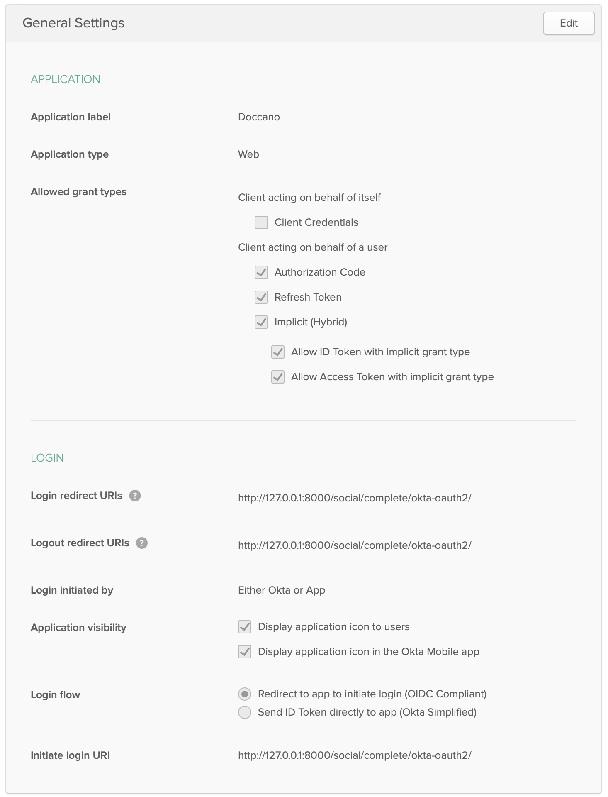
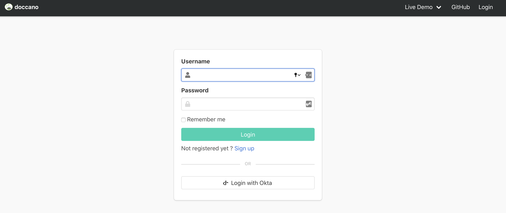

# How to use OAuth

This document aims to instruct how to setup OAuth for doccano. doccano now supports social login via GitHub and Active Directory by [#75](https://github.com/doccano/doccano/pull/75). In this document, we show GitHub OAuth as an example.

# GitHub

## Create OAuth App

1. In the upper-right corner of GitHub, click your profile photo, then click **Settings**.
2. In the left sidebar, click **Developer settings**.
3. In the left sidebar, click **OAuth Apps**.
4. Click **New OAuth App**.
5. In "Application name", type the name of your app.
6. In "Homepage URL", type the full URL to your app's website.
7. In "Authorization callback URL", type the callback URL(e.g. <https://example.com/social/complete/github/>) of your app.
8. Click Register application.

## Set enviromental variables

Once the application is registered, your app's `Client ID` and `Client Secret` will be displayed on the following page:


1. Copy the `Client ID` and `Client Secret` from the Developer Applications of your app on GitHub.
2. Set the `Client ID` and `Client Secret` to enviromental variables:

```bash
export OAUTH_GITHUB_KEY=YOUR_CLIENT_ID
export OAUTH_GITHUB_SECRET=YOUR_CLIENT_SECRET
```

## Run server

```bash
python manage.py runserver
```

Go to login page:



# Okta

Create an Okta web app in the Okta developer portal and get the key and secret from the app details.

## OAuth2

If you want to use OAuth2, set these environment variables.

```bash
export OAUTH_OKTA_OAUTH2_KEY=YOUR_CLIENT_ID
export OAUTH_OKTA_OAUTH2_SECRET=YOUR_CLIENT_SECRET
export OAUTH_OKTA_OAUTH2_API_URL=YOUR_BASE_URL
```

In the app settings, please set the redirect URI to `{DOCCANO_URL}/social/complete/okta-oauth2/`. For example, if you are serving Doccano at `https://example.com`, the redirect URI should be `https://example.com/social/complete/okta-oauth2/`. If using a local installation being served at port 8000, set the redirect URI to `http://127.0.0.1:8000/social/complete/okta-oauth2/`.

Okta Application setup:


Optionally, if you want to assign Doccano super users from Okta users, you can use Okta groups to assign them the policy. This will also assign the users the staff role, allowing them to access the Django admin page and app. Ensure your Okta [authorization server can serve `groups` claims](https://developer.okta.com/docs/guides/customize-tokens-returned-from-okta/add-groups-claim-org-as/) and set the environment variable `OKTA_OAUTH2_ADMIN_GROUP_NAME`.

```bash
export OKTA_OAUTH2_ADMIN_GROUP_NAME=SUPERUSER_OKTA_GROUP_NAME
```

## OpenIDConnect

If you want to use OpenIDConnect, set these environment variables.

```bash
export OAUTH_OKTA_OPENIDCONNECT_KEY=YOUR_CLIENT_ID
export OAUTH_OKTA_OPENIDCONNECT_SECRET=YOUR_CLIENT_SECRET
export OAUTH_OKTA_OPENIDCONNECT_API_URL=YOUR_BASE_URL
```

In the app settings, please set the redirect URI to your app domain `/social/complete/okta-openidconnect/`. For example, if you are serving Doccano at `https://example.com`, the redirect URI should be `https://example.com/social/complete/okta-openidconnect/`. If using a local installation being served at port 8000, set the redirect URI to `http://127.0.0.1:8000/social/complete/okta-openidconnect/`.

Optionally, if you want to assign Doccano super users from Okta users, you can use Okta groups to assign them the policy. This will also assign the users the staff role, allowing them to access the Django admin page and app. Ensure your Okta [authorization server can serve `groups` claims](https://developer.okta.com/docs/guides/customize-tokens-returned-from-okta/add-groups-claim-org-as/) and set the environment variable `OKTA_OPENIDCONNECT_ADMIN_GROUP_NAME`.

```bash
export OKTA_OPENIDCONNECT_ADMIN_GROUP_NAME=SUPERUSER_OKTA_GROUP_NAME
```

## Run Server

```bash
python manage.py runserver
```

If everything has been setup correctly, you should see a login page like the one below with an option to login using Okta.

