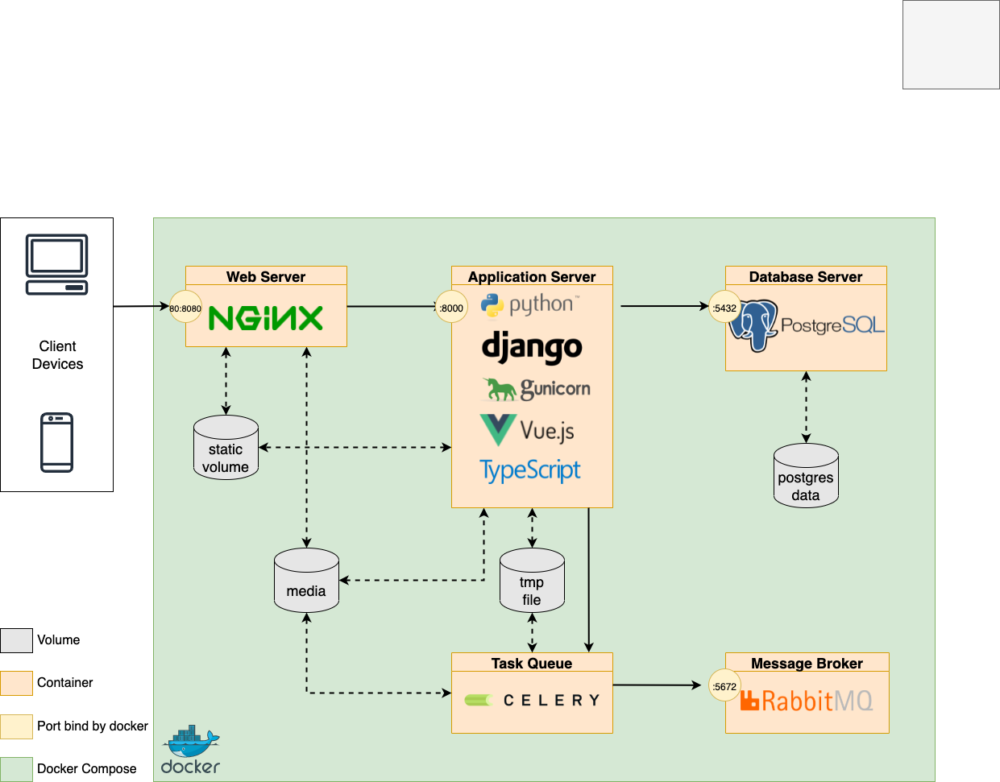
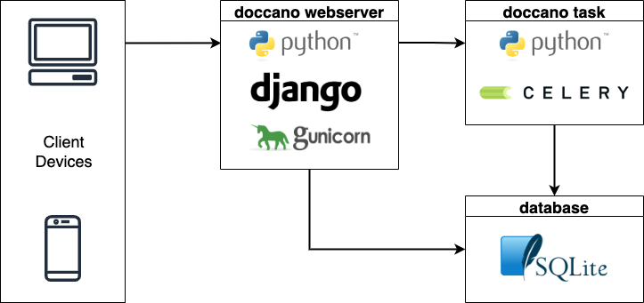

# Developer Guide

The important directories are as follows:

```bash
├── backend/
├── docker/
├── frontend/
└── tools/
```

## backend

The `backend/` directory includes the backend's REST API code. These APIs are built by [Python 3.8+](https://www.python.org/) and [Django 4.0+](https://www.djangoproject.com). The all of the packages are managed by Poetry, Python packaging and dependency management software. The directory structure of the backend follows mainly [Django](https://www.djangoproject.com) one. The following table shows the main files and directories:

| file or directory |                                                                                                                                            description                                                                                                                                             |
| ----------------- | -------------------------------------------------------------------------------------------------------------------------------------------------------------------------------------------------------------------------------------------------------------------------------------------------- |
| api/              | Django application. In the older versions, this manages all the APIs. Now, there is only an API to check the status of Celery tasks.                                                                                                                                                               |
| auto_labeling/    | Django application. This manages the features related to auto labeling.                                                                                                                                                                                                                            |
| config/           | Django settings. This includes multiple setting files like production and development.                                                                                                                                                                                                             |
| data_export/      | Django application. This manages the features related to data export.                                                                                                                                                                                                                              |
| data_import/      | Django application. This manages the features related to data import.                                                                                                                                                                                                                              |
| examples/         | Django application. This manages the features related to manipulate [examples](https://developers.google.com/machine-learning/glossary#example).                                                                                                                                                   |
| label_types/      | Django application. This manages the feature related to label types.                                                                                                                                                                                                                               |
| labels/           | Django application. This manages the feature related to labeling.                                                                                                                                                                                                                                  |
| metrics/          | Django application. This manages the feature related to project metrics like the progress for each user, label distribution and so on.                                                                                                                                                             |
| projects/         | Django application. This manages the feature related to project manipulation. A project includes its members, examples, label types, and labels.                                                                                                                                                   |
| roles/            | Django application. This manages the feature related to roles. There are three roles: administrator, annotator, approver. These roles are assigned to the project members and defines their permission.                                                                                            |
| users/            | Django application. This manages the feature related to users.                                                                                                                                                                                                                                     |
| cli.py            | This defines the command line interfaces. If you install doccano by Python package, this file is used to setup database, create a superuser, run webserver and so on.                                                                                                                              |
| manage.py         | Django management script. See [django-admin and manage.py](https://docs.djangoproject.com/en/4.0/ref/django-admin/) in detail.                                                                                                                                                                     |
| poetry.lock       | Related to Poetry. This file prevents you from automatically getting the latest versions of your dependencies. See [Basic usage](https://python-poetry.org/docs/basic-usage/) in Poetry documentation.                                                                                             |
| pyproject.toml    | This file contains build system requirements and information, which are used by pip to build the package. See [pyproject.toml](https://pip.pypa.io/en/stable/reference/build-system/pyproject-toml/) and [The pyproject.toml file in Poetry](https://python-poetry.org/docs/pyproject/) in detail. |

If you want to setup the backend environment, please see [Installation guide](./install-and-upgrade-doccano.md#install-from-source).


## docker

|          file          |                                                       description                                                        |
| ----------------------- | ------------------------------------------------------------------------------------------------------------------------ |
| nginx/                  | The `nginx` directory contains a NGINX configuration files. They are used only in `docker-compose.prod.yml`.             |
| .env.example            | The example of `.env` file. This is used only in `docker-compose.prod.yml`.                                              |
| docker-compose.prod.yml | This file contains Docker Compose configuration to run a production environment. We adopted the three tier architecture. |
| Dockerfile              | The dockerfile. You can pull the image from [doccano/doccano](https://hub.docker.com/r/doccano/doccano).                 |
| Dockerfile.heroku       | The dockerfile for Heroku.                                                                                               |
| Dockerfile.nginx        | The dockerfile to build nginx container. This is used only in `docker-compose.prod.yml`.                                 |
| Dockerfile.prod         | The dockerfile to build application container. This is used only in `docker-compose.prod.yml`.                           |

The architecture of the `docker-compose.prod.yml` is as follows:



On the other hand, the one of the `Dockerfile` is as follows:


## frontend

The `frontend/` directory contains frontend code. The `frontent` directory structure follows [Nuxt.js](https://ru.nuxtjs.org) one. See the [Nuxt.js documentation](https://nuxtjs.org/guide/directory-structure/) in details.

## tools

The `tools` directory contains some shell scripts. They are mainly used in Docker containers:

|       file        |                                                     description                                                      |
| ----------------- | -------------------------------------------------------------------------------------------------------------------- |
| create-package.sh | This script creates doccano's Python package. Note that yarn and poetry must already be installed.                   |
| heroku.sh         | This script is used to create django's superuser in Heroku.                                                          |
| prod-celery.sh    | This script is used to run celery in `docker-compose.prod.yml`.                                                      |
| prod-django.sh    | This script is used to run gunicorn in `docker-compose.prod.yml`. In addition, create roles, superuser, and migrate. |
| run.sh            | This script is used in `Dockerfile`. After creating roles and superuser, run gunicorn and celery.                    |

## Architecture of Python package


