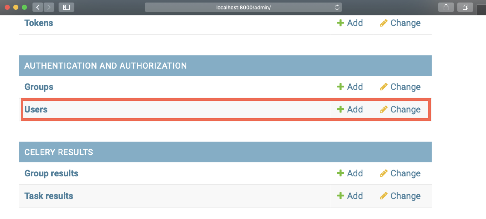

# FAQ

## How to create a user

To create a new doccano user:

1. Run the doccano webserver. 
2. Log in to the admin site (in the case of pip installation) via <http://localhost:{port}/admin/>. 

      The example below uses the port `8000` and username `admin`. If you set your own port or username and password on running the server, use those values to log in.
      
3. After logging in to the admin site, click **Users**:
      
4. Click the **ADD USER** button in the upper right corner:
      
5. After entering the username and password for the new user, click **SAVE**:
      

Congratulations. Now you can log in to doccano as a new user. After logging out of the admin site, try logging in to doccano as a new user.

## How to add a user to your project

**Note**: You must be the administrator of the project to add new users to it. These instructions also assume that you have already created a new user. See [How to create a user](#how-to-create-a-user) above.

To add a user to your project:

1. Log in to doccano. 
2. Click on your project. 
3. From the left side menu, click **Members**. If you are not the administrator of the project, **Members** will not appear.
      
4. Click **Add** and fill in the Add Member form with the user name and role you want to add to the project. 
5. Click **Save**.
      

Now the new user can access the project.

## How to change the password

To change a user's password:

1. Run the doccano webserver.
2. Log in to the admin site (in the case of pip installation) via <http://localhost:{port}/admin/>. 

      **Note**: You need to have a staff permission to log in to the admin site. If you don't have the right permissions, ask the administrator to change your password.
      
3. Click **Users**.
      
4. Click on the name of the user whose password you want to change:
      
5. Click the link that says **this form** in the password section.
      
6. Fill out the form and change the password. 
      

## I can't upload my data

To troubleshoot, review this list: 

- File encoding: `UTF-8` is appropriate.
- Filename: alphabetic file name is suitable.
- File format selection: file format radio button should be selected properly.
- When you are using JSON/JSONL: Confirm JSON data is valid.
  - You can use [JSONLint](https://jsonlint.com/) or some other tool (when JSONL, pick one data and check it).
- When you are using CSV: Confirm CSV data is valid.
  - You can use Excel or some tools that have import CSV feature. 
- Lack of line: Data file should not contain blank line.
- Lack of field: Data file should not contain blank field.

**You don't need your real complete data to validate the file format. The picked data and masked data is suitable if your data is large or secret.**

## I want to change the port number

In the case of Docker Compose, you can change the port number by editing `docker-compose.prod.yml`. 

1. Change `80:8080` to `<your_port>:8080` in `nginx`/`ports` section as follows:

      ```yaml
      nginx:
         image: doccano/doccano:frontend
         ports:
         - <your_port>:8080
      ```

2. Add the `CSRF_TRUSTED_ORIGINS` environment variable to the `backend`/`environment` section as follows:

```yaml
   backend:
      image: doccano/doccano:backend
      environment:
         ...
         DJANGO_SETTINGS_MODULE: "config.settings.production"
         CSRF_TRUSTED_ORIGINS: "http://127.0.0.1:<your_port>"
```

## I want to update to the latest doccano image

1. Execute `git pull` to reflect the latest doccano.
2. Delete the volume that `doccano_node_modules`, `doccano_static_volume`, `doccano_venv` and `doccano_www`. 
   **Do not delete `doccano_postgres_data` because it stores your projects data.**
3. Rebuild the doccano image.

The following commands are the procedure for 2~3.

```bash
❯ docker volume ls
DRIVER              VOLUME NAME
local               doccano_node_modules
local               doccano_postgres_data
local               doccano_static_volume
local               doccano_venv
local               doccano_www
❯ docker volume rm doccano_node_modules doccano_static_volume doccano_venv doccano_www
❯ docker-compose -f docker-compose.prod.yml build --no-cache
```

## django.db.utils.OperationalError: no such function: JSON_VALID

doccano uses JSONField on SQLite. So you need to enable the JSON1 extension on Python's sqlite3 library. If the extension is not enabled on your installation, a system error will be raised. This is especially related to the user who uses macOS and Python which is less than 3.7, Windows and Python which is less than 3.9.

If you have this problem, try [enabling JSON1 extension on SQLite](https://code.djangoproject.com/wiki/JSON1Extension).

## CSRF failed

If you have this problem, set the `CSRF_TRUSTED_ORIGINS` environment variable to your domain name. For example, if your domain name is `example.com`, set `CSRF_TRUSTED_ORIGINS=example.com`. In the debug mode, the default value is `http://127.0.0.1:3000`, `http://0.0.0.0:3000`, and `http://localhost:3000`. If you are using Docker Compose, set `CSRF_TRUSTED_ORIGINS` in `docker-compose.prod.yml`:

```yaml
backend:
    image: doccano/doccano:backend
    environment:
      ...
      DJANGO_SETTINGS_MODULE: "config.settings.production"
      CSRF_TRUSTED_ORIGINS: "http://192.168.10.3:3000"
```
