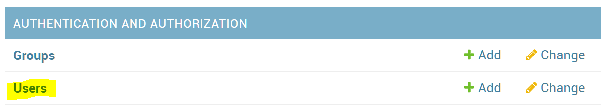

# FAQ

## I can't upload my data

Please check the following list.

- File encoding: `UTF-8` is appropriate.
- Filename: alphabetic file name is suitable.
- File format selection: File format radio button should be selected properly.
- When you are using JSON/JSONL: Confirm JSON data is valid.
  - You can use [JSONLint](https://jsonlint.com/) or some other tool (when JSONL, pick one data and check it).
- When you are using CSV: Confirm CSV data is valid.
  - You can use Excel or some tools that have import CSV feature. 
- Lack of line: Data file should not contain blank line.
- Lack of field: Data file should not contain blank field.

**You don't need your real & all data to validate file format. The picked data & masked data is suitable if your data is large or secret.**

## I want to add annotators annotators/annotation approvers

1. Add a user from [Django Admin site](https://djangobook.com/django-admin-site/).

2. **Logout from Django Admin site.** [You'll face login error without logout of Django Admin site](https://github.com/doccano/doccano/issues/723).
3. Add the user to the project in the member page (`/projects/{project_id}/members`).

## I want to update to the latest doccano image

1. Execute `git pull` to reflect the latest doccano.
2. Delete the volume that `doccano_node_modules`, `doccano_static_volume`, `doccano_venv` and `doccano_www`.
  **Do not delete `doccano_postgres_data` because it stores your projects data.**
3. Rebuild the doccano image.

The following commands are the procedure for 2~3.

```
❯ docker volume ls
DRIVER              VOLUME NAME
local               doccano_node_modules
local               doccano_postgres_data
local               doccano_static_volume
local               doccano_venv
local               doccano_www
❯ docker volume rm doccano_node_modules doccano_static_volume doccano_venv doccano_www
❯ docker-compose -f docker-compose.prod.yml build --no-cache
```
