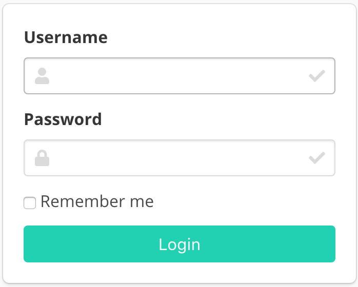

# Getting started

## Quick install guide

First of all, you have to clone the repository:

```bash
git clone https://github.com/chakki-works/doccano.git
cd doccano
```

To install doccano, there are three options:

### Option1: Pull the production Docker image

```bash
docker pull chakkiworks/doccano
```

### Option2: Pull the development Docker-Compose images

```bash
docker-compose pull
```

### Option3: Setup Python environment

First we need to install the dependencies. Run the following commands:

```bash
pip install -r requirements.txt
cd app
```

Next we need to start the webpack server so that the frontend gets compiled continuously.
Run the following commands in a new shell:

```bash
cd server/static
npm install
npm run build
# npm start  # for developers
cd ..
```

## Usage

Let’s start the development server and explore it.

Depending on your installation method, there are two options:

### Option1: Running the Docker image as a Container

First, run a Docker container:

```bash
docker run -d --name doccano -p 8000:80 chakkiworks/doccano
```

Then, execute `create-admin.sh` script for creating a superuser.

```bash
docker exec doccano tools/create-admin.sh "admin" "admin@example.com" "password"
```

### Option2: Running the development Docker-Compose stack

We can use docker-compose to set up the webpack server, django server, database, etc. all in one command:

```bash
docker-compose up
```

Now, open a Web browser and go to <http://127.0.0.1:8000/login/>. You should see the login screen:



### Option3: Running Django development server

Before running, we need to make migration. Run the following command:

```bash
python manage.py migrate
```

Next we need to create a user who can login to the admin site. Run the following command:

```bash
python manage.py create_admin --noinput --username "admin" --email "admin@example.com" --password "password"
```

Developers can also validate that the project works as expected by running the tests:

```bash
python manage.py test server.tests
```

Finally, to start the server, run the following command:

```bash
python manage.py runserver
```