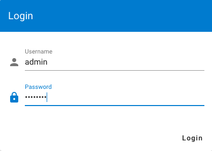
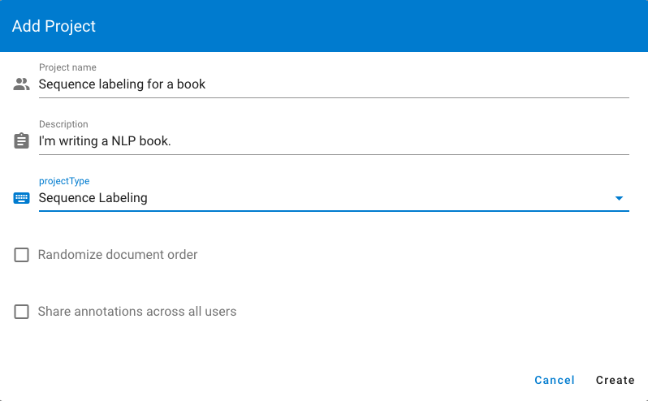
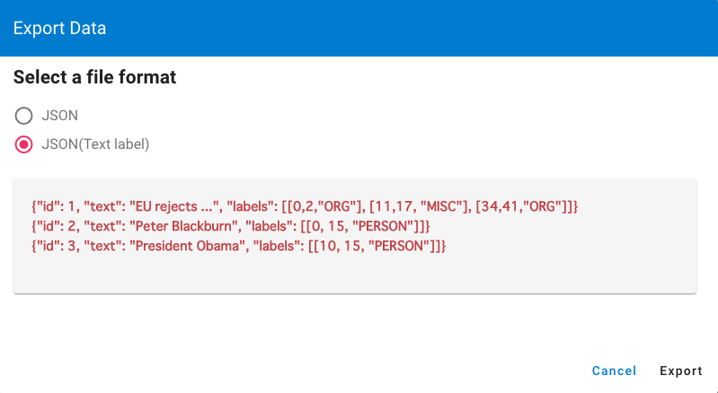

# Tutorial
## Dataset

Here we take an NER annotation task for science fictions to give you a brief tutorial on doccano.

Below is a JSON file containing lots of science fictions description with different languages. We need to annotate some entities like people name, book title, date and so on. 

`books.json`
```JSON
{"text": "The Hitchhiker's Guide to the Galaxy (sometimes referred to as HG2G, HHGTTGor H2G2) is a comedy science fiction series created by Douglas Adams. Originally a radio comedy broadcast on BBC Radio 4 in 1978, it was later adapted to other formats, including stage shows, novels, comic books, a 1981 TV series, a 1984 video game, and 2005 feature film."}
{"text": "《三体》是中国大陆作家刘慈欣于2006年5月至12月在《科幻世界》杂志上连载的一部长篇科幻小说，出版后成为中国大陆最畅销的科幻长篇小说之一。2008年，该书的单行本由重庆出版社出版。本书是三体系列（系列原名为：地球往事三部曲）的第一部，该系列的第二部《三体II：黑暗森林》已经于2008年5月出版。2010年11月，第三部《三体III：死神永生》出版发行。 2011年，“地球往事三部曲”在台湾陆续出版。小说的英文版获得美国科幻奇幻作家协会2014年度“星云奖”提名，并荣获2015年雨果奖最佳小说奖。"}
{"text": "『銀河英雄伝説』（ぎんがえいゆうでんせつ）は、田中芳樹によるSF小説。また、これを原作とするアニメ、漫画、コンピュータゲーム、朗読、オーディオブック等の関連作品。略称は『銀英伝』（ぎんえいでん）。原作は累計発行部数が1500万部を超えるベストセラー小説である。1982年から2009年6月までに複数の版で刊行され、発行部数を伸ばし続けている。"}
```

## Create a project

We need to create a new project for this task. Logging in with the superuser account. 



To create your project, make sure you’re in the project list page and click `Create` button. As for this tutorial, we name the project as `sequence labeling for books`, write some description, choose the sequence labeling task type.




## Import Data

After creating a project, we will see the `Dataset` page, and click `Import dataset` button in the `Actions` menu. We should see the following screen:


We choose `JSON` and click `Select a file` button. Select `books.json` and it would be loaded automatically. 

## Define labels

Click `Labels` button in left bar to define our own labels. We should see the label editor page. In label editor page, you can create labels by specifying label text, shortcut key, background color and text color.


As for the tutorial, we created some entities related to science fictions.

## Annotation

Next, we are ready to annotate the texts. Just click the `Start annotation` button in the navigation bar, we can start to annotate the documents.


## Export Data

After the annotation step, we can download the annotated data. Go to the `Dataset` page and click the `Export dataset` button in the `Action` menu. After selecting an export format, click `Export`. You should see below screen:



Here we choose JSONL file to download the data by clicking the button. Below is the annotated result for our tutorial project.

`sequence_labeling_for_books.json`
```JSON
{"doc_id": 33, 
 "text": "The Hitchhiker's Guide to the Galaxy (sometimes referred to as HG2G, HHGTTGor H2G2) is a comedy science fiction series created by Douglas Adams. Originally a radio comedy broadcast on BBC Radio 4 in 1978, it was later adapted to other formats, including stage shows, novels, comic books, a 1981 TV series, a 1984 video game, and 2005 feature film.", 
 "labels": [[0, 36, "Title"], [63, 67, "Title"], [69, 75, "Title"], [78, 82, "Title"], [89, 111, "Genre"], [130, 143, "Person"], [158, 180, "Genre"], [184, 193, "Other"], [199, 203, "Date"], [254, 265, "Genre"], [267, 273, "Genre"], [275, 286, "Genre"], [290, 294, "Date"], [295, 304, "Genre"], [308, 312, "Date"], [313, 323, "Genre"], [329, 333, "Date"], [334, 346, "Genre"]], 
 "username": "admin"}
```

Congratulation! You just mastered how to use doccano for a sequence labeling project. 
