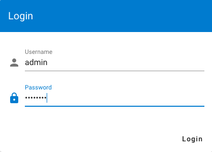
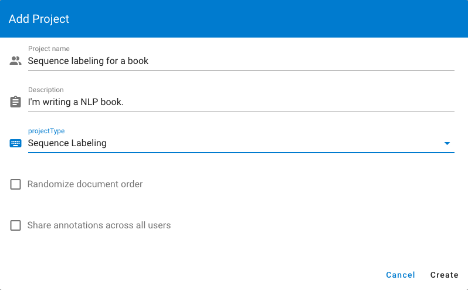
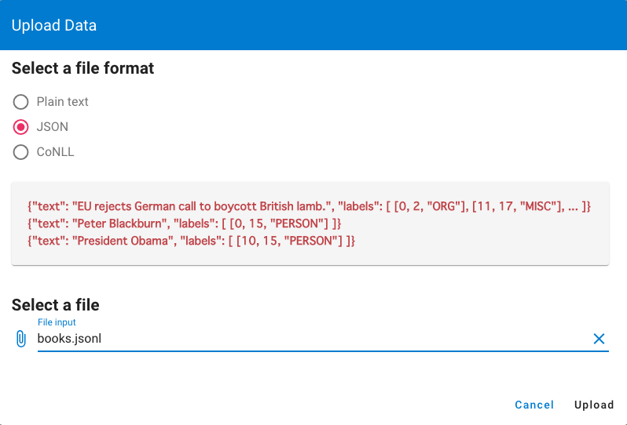
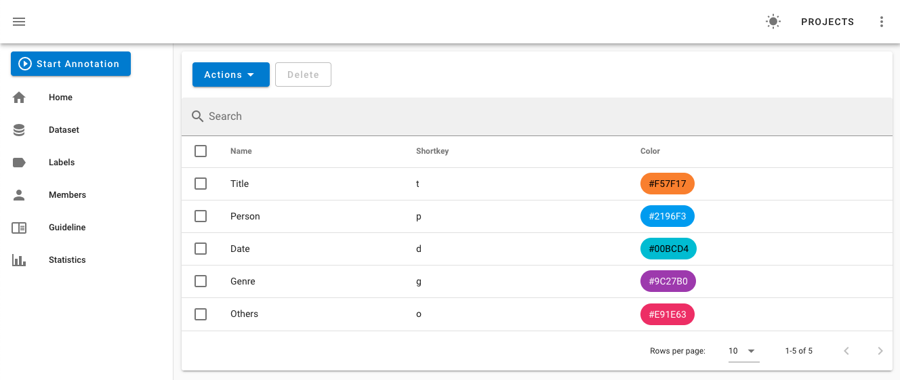
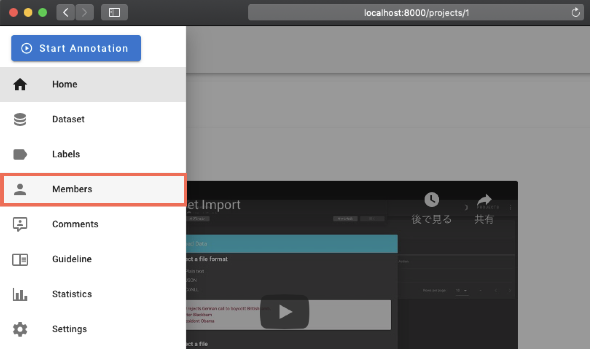
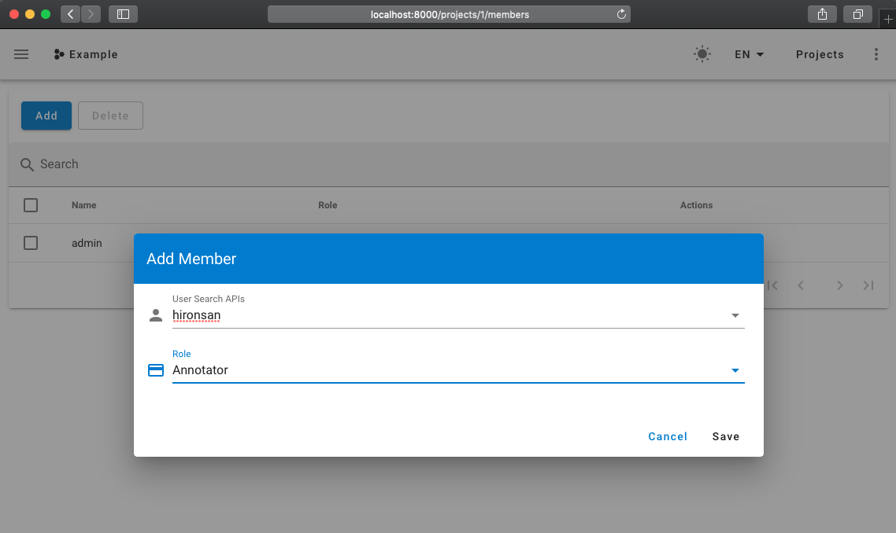
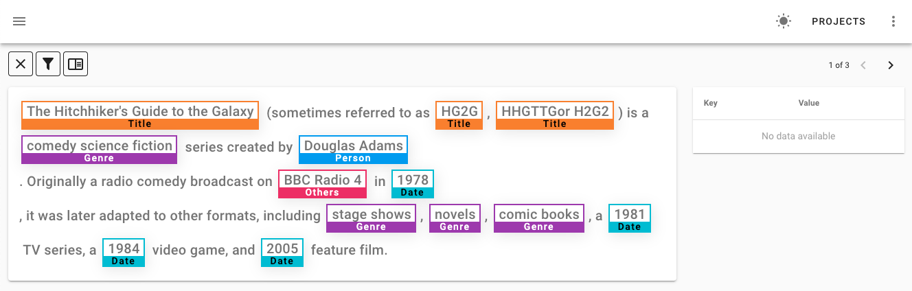
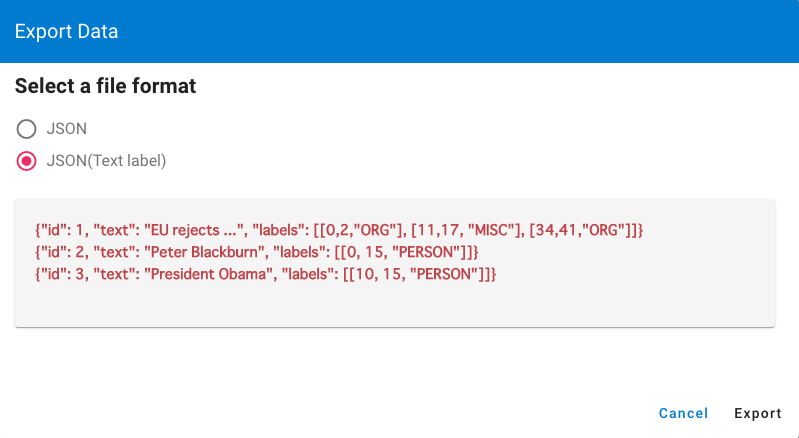

# Tutorial

This tutorial demonstrates how to use doccano to complete a named entity recognition annotation task for an example science fiction dataset.

## Dataset

Here is a JSON file named `books.json` containing lots of science fiction book descriptions in different languages. We need to annotate some entities like names, book titles, dates, and so on.

```json
{"text": "The Hitchhiker's Guide to the Galaxy (sometimes referred to as HG2G, HHGTTGor H2G2) is a comedy science fiction series created by Douglas Adams. Originally a radio comedy broadcast on BBC Radio 4 in 1978, it was later adapted to other formats, including stage shows, novels, comic books, a 1981 TV series, a 1984 video game, and 2005 feature film."}
{"text": "《三体》是中国大陆作家刘慈欣于2006年5月至12月在《科幻世界》杂志上连载的一部长篇科幻小说，出版后成为中国大陆最畅销的科幻长篇小说之一。2008年，该书的单行本由重庆出版社出版。本书是三体系列（系列原名为：地球往事三部曲）的第一部，该系列的第二部《三体II：黑暗森林》已经于2008年5月出版。2010年11月，第三部《三体III：死神永生》出版发行。 2011年，“地球往事三部曲”在台湾陆续出版。小说的英文版获得美国科幻奇幻作家协会2014年度“星云奖”提名，并荣获2015年雨果奖最佳小说奖。"}
{"text": "『銀河英雄伝説』（ぎんがえいゆうでんせつ）は、田中芳樹によるSF小説。また、これを原作とするアニメ、漫画、コンピュータゲーム、朗読、オーディオブック等の関連作品。略称は『銀英伝』（ぎんえいでん）。原作は累計発行部数が1500万部を超えるベストセラー小説である。1982年から2009年6月までに複数の版で刊行され、発行部数を伸ばし続けている。"}
```

## Create a project

To start, let's create a new project for this task.

1. Log in to doccano with the superuser account.
      
2. To create your project, go to the project list page and click **Create**.
3. Fill out the project details. For this tutorial, name the project `sequence labeling for books`, write a description, and choose the sequence labeling task type.



## Import a dataset

After creating a project, the **Dataset** page appears. 

To import a dataset:

1. Click **Actions** > **Import Dataset**. You should see the following screen:
      
2. Choose **JSON** and click **Select a file**.
3. Click **books.json** and it will load automatically.

## Define labels

Define the labels to use for your annotation project:

1. Click **Labels** in the left side menu. You should see the label editor page. 
2. On the label editor page, create labels by specifying label text, a shortcut key, background color, and text color. For this tutorial, let's create some entities related to science fiction, as shown below.



## Add members

Members are users who can participate in labeling activities. To add members:

1. Click **Members** in the left side menu. If you are not the project administrator, the button won't appear.
      
2. Click **Add** to display the Add Member form. 
      
3. Fill in the form with the user name and role you want to add to the project. If there is no user to select, you need to create the user first. See the [FAQ](./faq.md) for instructions.
4. Click **Save**.

## Annotation

Next, let's annotate the texts. 

Click **Start annotation** in the navigation bar to start annotating the documents.



## Export the dataset

After finishing the annotation step, let's download the annotated data. 

1. Go to the **Dataset** page and click **Action** > **Export Dataset**.
2. Select an export format. For this tutorial choose the JSONL format.
3. Click **Export**. You should see this screen:



 Below is the annotated result for this tutorial.

`sequence_labeling_for_books.json`

```json
{"doc_id": 33, 
 "text": "The Hitchhiker's Guide to the Galaxy (sometimes referred to as HG2G, HHGTTGor H2G2) is a comedy science fiction series created by Douglas Adams. Originally a radio comedy broadcast on BBC Radio 4 in 1978, it was later adapted to other formats, including stage shows, novels, comic books, a 1981 TV series, a 1984 video game, and 2005 feature film.", 
 "labels": [[0, 36, "Title"], [63, 67, "Title"], [69, 75, "Title"], [78, 82, "Title"], [89, 111, "Genre"], [130, 143, "Person"], [158, 180, "Genre"], [184, 193, "Other"], [199, 203, "Date"], [254, 265, "Genre"], [267, 273, "Genre"], [275, 286, "Genre"], [290, 294, "Date"], [295, 304, "Genre"], [308, 312, "Date"], [313, 323, "Genre"], [329, 333, "Date"], [334, 346, "Genre"]], 
 "username": "admin"}
```

Congratulations! You just explored how to use doccano for a sequence labeling project.
